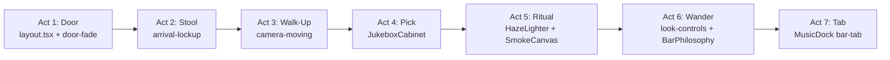

# Frontend & UI Audit — Jeffrey's Jukebox

**Build status:** `npx next build` passes on **Next.js 16.2.10 (Turbopack)** — static `/` route, zero TypeScript errors.

**Brand doc note:** `The classic dive bar jukebox brand.md` is not in the repo (likely a prior chat attachment). Ideas below are synthesized from `README.md`, implemented code, and prior brainstorm references (Sharpie wall, bar tab, joint ritual, stool immersion, Indy flavor).

---

## Executive summary

Jeffrey's Jukebox has the right **immersive concept** and a **sound component split** after recovery work (`JukeboxStage` → `Jukebox` with atmosphere/foreground slots, extracted hooks and cabinet). What still reads as a "broken web app" is primarily **styling architecture**: ~1,020 lines of monolithic `globals.css` versus almost no Tailwind in components, duplicate design tokens, and fixed UI overlays that float on top of photos instead of feeling anchored in the room.

Architecturally, Next.js 16 is used lightly — `page.tsx` is an RSC, but `MoodProvider` forces the **entire tree client-side** (14 `"use client"` files). Images are handled correctly via `next/image`; there are **no Suspense boundaries** and no loading skeletons. The core experience — single-page room, Web Audio, Canvas smoke, 120-title catalog — should be preserved; the upgrade path is **token discipline + journey choreography**, not a SaaS redesign.

---

## Architecture map

```
app/layout.tsx (RSC)          — Caveat font, metadata, viewport
└── app/page.tsx (RSC)        — imports tracks[], wraps provider
    └── MoodProvider (client) — lib/mood.tsx: haze, smoke density, room view
        └── JukeboxStage (client)
            └── Jukebox (client) — orchestrator, room nav, media session
                ├── atmosphere: SmokeCanvas (Canvas 2D)
                ├── foreground: BarPhilosophy (coaster / napkin thoughts)
                ├── JukeboxCabinet (visual machine)
                ├── MusicDock (persistent now-playing / bar tab)
                ├── AudioEmber (joint + analyser pulse)
                ├── HazeLighter (ignite ritual)
                └── hooks: useJukeboxAudio, useRemotePlayback
```

**Layer stack** (from `data-layer` attributes in `jukebox.tsx` / `JukeboxCabinet.tsx`):

| Z-order | Layer | File |
|---------|-------|------|
| 0 | Room photo | `jukebox.tsx` → `scene-backdrop` |
| 1 | Atmosphere (smoke) | `SmokeCanvas.tsx` via `stage-atmosphere` |
| 2 | Jukebox cabinet | `JukeboxCabinet.tsx` |
| 3 | Controls / coaster | nav, dock, arrival lockup, `BarPhilosophy` |

**Grep summary:**

| Pattern | Result |
|---------|--------|
| `"use client"` | **14 files** — all components, both hooks, `lib/mood.tsx` |
| ` p`). | Anchor chrome to **scene coordinates** per view; use `clamp()` + safe-area grid; never hide the value prop on small screens — shorten copy instead. |
| Cabinet vs. room photo | **High** | `globals.css` `.standing-back .jukebox-zone` (scale 0.44, translate) | Standing-back state shrinks cabinet into corner — clever, but transition to `approached` feels like a **widget zoom**, not walking to a machine in the photo. | Add **photo hotspot alignment** (cabinet bottom anchored to bar surface in `intro-screen.png`); soften scale with perspective transform tied to `scene-backdrop` zoom. |
| Token drift | **Medium** | `app/globals.css` L3–27 | `--color-alley-*` in `@theme` never referenced; components hardcode `#080706`, `#6f211c`, etc. | Replace magic values with `bg-alley-oxblood`, `text-alley-nicotine`, `font-machine`, `font-signage`. |
| Signed wall depth | **Medium** | `globals.css` `.story-right::before` L321–329 | Sharpie/graffiti is a **static SVG texture** — brand vision called for interactive wall marks. | Add clickable Sharpie hotspots on signed-wall view (Caveat font overlays, fade-in on tap). |
| Bar tab polish | **Low** | `MusicDock.tsx` L38, L67–70 | Bar tab concept exists (`bar-tab`, dashed border, tab footer) but reads as a **styled dock**, not a torn receipt. | Add receipt tear edge, handwritten totals, "BARTENDER: JACOB" stamp — pure CSS on existing structure. |
| Image format | **Low** | `public/images/intro-screen.png` | Only hero is PNG; others are WebP. Larger LCP payload. | Convert to WebP/AVIF; keep `priority` on center view only. |

---

## Next.js 16 architectural alignment

| Area | Severity | Location | Issue | Recommendation |
|------|----------|----------|-------|----------------|
| Client boundary | **High** | `app/page.tsx` L7–8, `lib/mood.tsx` | `MoodProvider` is `"use client"`, so **100% of UI hydrates** despite static `tracks[]`. | Split: RSC shell renders static room frame + track metadata JSON; pass to lazy `JukeboxExperience` client island via `dynamic(() => import(...), { ssr: false })` only for audio/canvas. |
| No Suspense / loading | **Medium** | `app/page.tsx`, `jukebox.tsx` L126 | Hero `Image` has `priority` but no fallback; room fades from black with CSS only — fine on fast networks, blank on slow. | Wrap client island in `<Suspense fallback={<RoomSkeleton />}>`; skeleton = dark room + location plaque (no cabinet). |
| Duplicate mood timers | **Medium** | `lib/mood.tsx` `isLazyDrift` vs `jukebox.tsx` `hazeSettled` L50–60, L120 | Same 5-minute lazy-drift logic implemented **twice**; `isLazyDrift` in context is unused dead state. | Delete `hazeSettled` from `jukebox.tsx`; consume `isLazyDrift` from `useMood()`. |
| `next.config.ts` | **Low** | `next.config.ts` | Minimal config — acceptable for static local images. No `images.remotePatterns` needed (Cloudinary is audio-only). | Add `experimental` only if needed; document static export compatibility for Vercel. |
| Caching / RSC data | **Low** | `lib/tracks.ts` | Track catalog is build-time static — good candidate for RSC import. Already done. | Consider `"use cache"` on any future server helpers; not needed yet. |
| Font loading | **Low** | `app/layout.tsx` L5–9 | Caveat loaded via `next/font` — correct. Only used in coaster dialog via CSS `var(--font-caveat)`. | Add `display: "swap"`; preload only weights used (500–700 already scoped). |

---

## UX & motion

| Area | Severity | Location | Issue | Recommendation |
|------|----------|----------|-------|----------------|
| Arrival journey | **High** | `globals.css` `.door-fade`, `.arrival-lockup`, `jukebox.tsx` L138–158 | Door fade + lockup slide is good, but **no staged audio cue** (distant jukebox hum) and walk-up is instant class toggle. | Sequence: fade → lockup (1.6s delay, already in CSS) → optional ambient loop on first interaction → walk-up triggers `camera-moving` + 1.25s debounce (exists) — add **footstep/subtle low-pass swell** via existing Web Audio graph. |
| Haze ritual | **Medium** | `HazeLighter.tsx`, `lib/mood.tsx` L46–77 | Lighter click + density ramp is solid. Room overlay (`.room-haze`) and canvas smoke are coordinated. | Tie **joint burn-down** (`AudioEmber` L99–101) to haze toggle more visibly — cherry dims when air clears. |
| Reduced motion | **Medium** | `globals.css` L1017–1018 | Blanket `animation-duration: .01ms !important` kills **all** motion including functional feedback (page turn, mechanism). | Scope reduced motion to **decorative** animations only (`enter-room`, `lazy-drift`, `marquee-flicker`); keep mechanism/vinyl transitions. |
| Layout collisions | **Medium** | `globals.css` L289–291, L959–1015 | `has-music-dock` pushes nav up — implemented. Mobile still dense: dock + nav + coaster + ember compete for bottom 120px. | Define `--chrome-bottom` CSS variable computed from dock visibility; position coaster relative to **side-story panel**, not fixed corners. |
| Coaster discoverability | **Medium** | `BarPhilosophy.tsx` L36–37 | Coaster **hidden on center view** — intentional, but no affordance that side views have secrets. | Pulse coaster hint on first `look-left` / `look-right` visit; store in `sessionStorage`. |
| Catalog mobile height | **Low** | `globals.css` L1004 `.title-book { min-height: 735px }` | Title book forces tall scroll on small screens inside already-scrolling `.bar-room`. | Use `svh`-relative max-height + internal scroll on `.title-book`. |
| No page transitions | **Low** | `jukebox.tsx` look changes | Room photo swaps via `Image key={sceneImage}` — hard cut. | Crossfade backdrop images (opacity transition on stacked images). |

---

## Prioritized roadmap

### 1. Quick wins (same session)

- Consolidate `hazeSettled` → `useMood().isLazyDrift` in `jukebox.tsx`
- Convert `intro-screen.png` → WebP
- Scope `prefers-reduced-motion` to decorative keyframes only
- Wire `@theme` tokens into 5–10 highest-traffic classes (`.bar-location`, `.music-dock`, `.cabinet`, `.step-up`)
- Add backdrop **crossfade** on room view change (`jukebox.tsx` scene-backdrop)

### 2. Structural (multi-file, low risk)

- **Decompose `globals.css`** into:
  - `app/globals.css` — Tailwind import, `@theme`, reset, keyframes
  - `styles/room.css` — backdrop, shade, grain, haze, camera states
  - `styles/cabinet.css` — jukebox machine
  - `styles/chrome.css` — dock, nav, arrival, coaster
- Introduce `RoomChrome` server wrapper (static HTML shell) + lazy client island
- Add `<Suspense>` + minimal room skeleton
- Expand bar tab styling in `MusicDock.tsx` + `chrome.css`

### 3. Transformation (layout/system-level)

- **Stool immersion POV**: standing-back = seated at bar; walk-up = lean forward; approached = hands on cabinet
- **Sharpie wall**: interactive marks on signed-wall view (SVG + Caveat overlays)
- **Indy flavor layer**: Carrollton Ave micro-copy in arrival, dock, coaster headers (partially started in `highThoughts.ts`)
- Optional Framer Motion **only** for camera/lockup choreography — not for cabinet internals (CSS animations already work)

---

## Suggested first implementation target

**Cluster: Arrival → Walk-Up camera journey** (`components/jukebox.tsx` + `app/globals.css` room/camera section)

**Why this first:** It is the first 10 seconds Jeffrey experiences. Premium feel lives or dies here — before he touches the catalog, haze, or coaster. The code already has `door-fade`, `enter-room`, `camera-moving`, and `standing-back` / `approached` states; they need **token discipline, photo anchoring, and motion sequencing** rather than new features.

**Verify after:** 560px and 1280px widths, reduced-motion path, LCP on hero image, no CLS when music dock appears.

---

## Creative Journey Blueprint

### Vision: from "broken web app" → Alley Cat immersion

The app should feel like **one continuous evening** at 6267 Carrollton Ave — not a page with widgets. Preserve the non-negotiables:

| Keep (do not rip out) | Why |
|-----------------------|-----|
| Single-page room | Brand promise in `README.md` — never jump to generic player |
| Web Audio graph (`useJukeboxAudio.ts`) | Mood filter, analyser, scratch SFX |
| Canvas smoke (`SmokeCanvas.tsx`) | Cursor-reactive atmosphere |
| CSS mechanical cabinet (`JukeboxCabinet.tsx`) | Title book, vinyl, tonearm — the "machine" |
| 120-title catalog / 5 Jeffrey cuts (`lib/tracks.ts`) | Authentic jukebox fiction |

### Journey acts (mapped to files)



**Act 1 — Door (arrival)**  
- **Files:** `app/layout.tsx`, `globals.css` `.door-fade`, `.scene-backdrop` `enter-room`  
- **Now:** Black fade, room scales in.  
- **Premium:** Add barely audible room tone on first `pointerdown` (reuse `ensureAudioGraph` dry path). Location plaque uses `@theme` alley tokens.

**Act 2 — Stool (still seated)**  
- **Files:** `jukebox.tsx` arrival lockup L138–158, `globals.css` `.arrival-lockup`  
- **Brand idea:** "Your stool is still open" — copy exists, **visual missing**.  
- **Blueprint:** Add subtle stool-rail vignette at bottom of `scene-backdrop`; lockup feels like a plaque on the booth wall, not a card floating top-right. On mobile, show shortened tagline — don't `display: none` the paragraph.

**Act 3 — Walk-Up (camera)**  
- **Files:** `jukebox.tsx` `moveCamera()`, `.standing-back` / `.approached` / `.camera-moving` in `globals.css`  
- **Blueprint:** Sync `scene-backdrop` scale and `jukebox-zone` transform from shared CSS custom property `--camera-proximity` (0 = seated, 1 = at machine). Cabinet bottom edge aligns to bar surface in `intro-screen.png`.

**Act 4 — Pick a song (machine)**  
- **Files:** `JukeboxCabinet.tsx`, `useJukeboxAudio.ts`, `scratchSound.ts`  
- **Built:** Page turn, mechanism states, scratch rejection.  
- **Blueprint:** LED message typography uses `font-machine`; dummy-track rejection gets brief vinyl shake + scratch (already wired).

**Act 5 — Light one up (joint ritual)**  
- **Files:** `HazeLighter.tsx`, `lib/mood.tsx`, `SmokeCanvas.tsx`, `AudioEmber.tsx`  
- **Built:** Lighter click, smoke ramp, joint burn-down on elapsed time when hazy.  
- **Brand gap:** Ritual should feel **ceremonial** — 3-beat sequence: click → flame CSS → smoke rises → room status flips → ember ignites. Orchestrate from `mood.tsx` with `ritualPhase` enum instead of boolean `isHazeActive`.

**Act 6 — Look around (side views)**  
- **Files:** `jukebox.tsx` nav L173–191, `BarPhilosophy.tsx`, `highThoughts.ts`  
- **Built:** Pool room / signed wall photos, coaster thoughts, Indy sober copy.  
- **Brand gap — Sharpie wall:** On `look-right`, replace static SVG texture with 3–5 tappable Sharpie marks (Caveat overlays, `"JT WAS HERE"`, `"NO FREE BIRD"`).  
- **Coaster:** Already anchored per-view (`coaster-anchor-left/right`); add bar-surface shadow beneath button.

**Act 7 — Bar tab (running bill)**  
- **Files:** `MusicDock.tsx`  
- **Built:** `bar-tab` class, `FREE (VIP)`, `Current Tab: 1 Cold Beer & 3 Smokes`.  
- **Blueprint:** Accumulate tab items across session (localStorage): each Jeffrey cut adds line item; haze adds "Loose Square — $0 (don't tell)"; render as running receipt footer.

### Tailwind v4 + minimal globals strategy

```
app/globals.css          → @import "tailwindcss", @theme tokens, @keyframes, focus ring
styles/room.css          → backdrop, camera, haze (imported from layout or jukebox)
styles/cabinet.css       → machine visuals
components/*.module.css  → component-specific (coaster, lighter, dock)
```

**Token contract** (single source in `@theme`):

```css
@theme {
  --color-alley-black: #070605;
  --color-alley-oxblood: #4f1515;
  --color-alley-nicotine: #c3a267;
  --font-family-machine: "Courier New", monospace;
  --font-family-signage: Georgia, "Times New Roman", serif;
  --font-family-hand: var(--font-caveat), cursive;
}
```

Delete duplicate `:root` block; reference `text-alley-nicotine`, `font-machine` in JSX for new work. Legacy classes migrate incrementally — **no big-bang rewrite**.

### RSC where possible

| Server (RSC) | Client island |
|--------------|---------------|
| `layout.tsx` metadata/fonts | `JukeboxExperience` (dynamic import) |
| `page.tsx` imports `tracks` | `MoodProvider` + all interaction |
| Static SEO / OG (future) | Web Audio, Canvas, Media Session |
| Room skeleton fallback | Coaster dialog, about panel |

---

## What NOT to change

- **Do not** add routes, dashboards, or a separate `/player` page
- **Do not** replace the CSS cabinet with a generic Shadcn music player
- **Do not** remove Canvas smoke for CSS fog only — use both, layered
- **Do not** drop the 120-title decorative catalog — it's core fiction
- **Do not** rip out Web Audio mood filtering for simpler `<audio>` playback
- **Do not** over-animate with Framer Motion everywhere — selective camera choreography only

---

## Top 5 highest-impact recommendations

1. **Unify the design system** — One `@theme` token source; decompose `globals.css`; stop the Tailwind/CSS split that caused layout chaos and "styled in isolation" components.

2. **Polish the Arrival → Walk-Up journey** — Anchor the cabinet to the room photo, sequence door → lockup → walk-up motion, fix mobile copy truncation. This is the premium first impression.

3. **Complete brand rituals still missing** — Sharpie wall interactivity (signed-wall view), fuller bar-tab receipt metaphor (`MusicDock`), ceremonial haze sequence (`HazeLighter` + `mood.tsx` phases).

4. **Shrink the client boundary** — RSC shell + lazy client island for audio/canvas; add Suspense skeleton. Reduces hydration cost without changing the experience.

5. **Eliminate duplicate mood state** — Use `isLazyDrift` from `lib/mood.tsx` everywhere; consider a `ritualPhase` state machine for haze/joint/smoke coordination.

---

*Note: Re-add `The classic dive bar jukebox brand.md` to the repo (or `docs/brand.md`) so future sessions can diff "vision vs. built" without relying on chat history.*

[REDACTED]